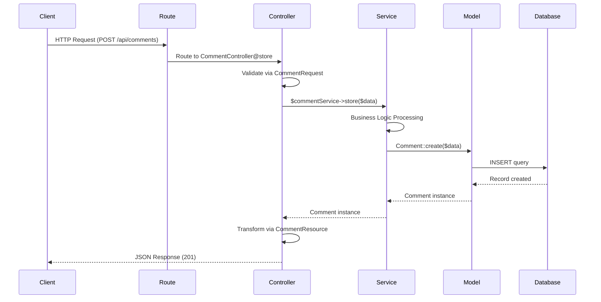

# Laravel API Scaffold

A comprehensive Laravel package that scaffolds Service layer architecture with API resources, controllers, and tests. This package follows best practices and provides a battle-tested structure for building maintainable Laravel applications.

## Description

Laravel API Scaffold automates the creation of service-oriented architecture components in your Laravel application. It generates well-structured service classes with interfaces, controllers with dependency injection, form requests, API resources, and comprehensive tests, all following Laravel conventions and best practices.

## Features

- 🏗️ **Service Layer Architecture**: Automatically generates service classes with their interfaces
- 🔌 **Dependency Injection**: Auto-registers service bindings in AppServiceProvider
- 🎯 **Complete API Scaffolding**: Creates Models, Migrations, Controllers, Requests, and Resources
- 🚀 **Laravel 11+ API Setup**: Automatically runs `php artisan install:api` for Laravel 11+ projects
- 🛣️ **Interactive Route Management**: Choose to append routes to api.php or create separate route files
- 🎛️ **Admin Panel Integration**: Generate Laravel Nova or Filament resources with auto-detection
- 📝 **Entity Documentation**: Auto-generate comprehensive markdown documentation for each entity
- 🧪 **Testing Ready**: Generates Pest/PHPUnit test files with common test cases
- ⚙️ **Highly Configurable**: Customize paths, namespaces, and generation options
- 🔒 **Safe Operations**: Automatic backups of existing files before modifications
- 📦 **Modular Approach**: Generate only what you need with granular options
- 🎨 **Custom Stubs**: Publish and customize stub templates to match your coding style

## Requirements

- PHP 8.1, 8.2, 8.3, or 8.4
- Laravel 10.x, 11.x, or 12.x
- Composer

## Installation

You can install the package via composer:

```bash
composer require iamgerwin/laravel-api-scaffold
```

### Publish Configuration (Optional)

Publish the configuration file to customize the package behavior:

```bash
php artisan vendor:publish --tag="api-scaffold-config"
```

### Publish Stubs (Optional)

Publish the stub templates if you want to customize the generated files:

```bash
php artisan vendor:publish --tag="api-scaffold-stubs"
```

## Usage

### Interactive Mode (New!)

The package now features an intuitive interactive mode that guides you through the scaffolding process. When you run the command without any flags, it automatically launches an interactive wizard:

```bash
php artisan make:service-api Product
```

The interactive wizard will:
1. **Preset Selection**: Choose from predefined templates (Minimal, API Complete, Service Layer, or Custom)
2. **Component Selection**: Select which components to generate
3. **Preview & Confirm**: Review your selections before generating files
4. **Cache Preferences**: Remember your choices for next time

#### Available Presets

- **Minimal**: Service and Interface only
- **API Complete**: Full API scaffold with all components (Service, Interface, Model, Migration, Controller, Request, Resource, Tests)
- **Service Layer**: Service, Interface, Model, and Tests (great for business logic-heavy applications)
- **Custom**: Choose components individually

#### Interactive Mode Options

```bash
# Force interactive mode (even with flags)
php artisan make:service-api Product --interactive

# Disable interactive mode (use flags instead)
php artisan make:service-api Product --no-interactive --all
```

### Automatic Laravel 11+ API Setup

When using Laravel 11 or higher, the package automatically detects if your project needs API scaffolding:

- **Auto-detection**: Checks if `routes/api.php` exists
- **Auto-installation**: Runs `php artisan install:api` if needed
- **Seamless setup**: Installs Laravel Sanctum and sets up API routes automatically

This ensures your Laravel 11+ project is properly configured for API development without manual intervention.

### Interactive Route Management

After generating a controller, the package offers an interactive prompt to add routes for your new resource:

```bash
Would you like to add API routes for this resource? (yes/no)
```

You can choose between two route management strategies:

#### Option 1: Append to routes/api.php
Routes are added directly to your main API routes file:

```php
// Product API Routes
Route::apiResource('products', ProductController::class);
```

**Best for:**
- Small to medium projects
- Quick prototyping
- Simple API structures

#### Option 2: Create separate route file
Creates a dedicated route file at `routes/api/{model}.php`:

```php
<?php

use App\Http\Controllers\ProductController;
use Illuminate\Support\Facades\Route;

// Product API Routes
Route::apiResource('products', ProductController::class);
```

And automatically includes it in `routes/api.php`:

```php
require __DIR__.'/api/product.php';
```

**Best for:**
- Large projects with many resources
- Better organization and separation of concerns
- Team collaboration (reduces merge conflicts)
- Modular API design

### Basic Usage

Generate a service with its interface (non-interactive):

```bash
php artisan make:service-api Comment --no-interactive
```

This creates:
- `app/Services/Comment/CommentService.php`
- `app/Services/Comment/CommentServiceInterface.php`
- Automatically registers the binding in `AppServiceProvider`

### Generate with API Methods

Create a service with predefined CRUD methods:

```bash
php artisan make:service-api Comment --api
```

This generates a service with the following methods:
- `index()` - Get paginated list
- `show($id)` - Get single record
- `store(array $data)` - Create new record
- `update($id, array $data)` - Update existing record
- `destroy($id)` - Delete record

### Generate All Related Files

Create a complete API resource with one command:

```bash
php artisan make:service-api Comment --all
```

This generates:
- Service and Interface
- Model
- Migration
- Controller (with service injection)
- Form Request
- API Resource
- Feature Test

### Granular Control

Generate only specific components:

```bash
# Service with controller and request only
php artisan make:service-api Comment --controller --request

# Service with model and migration only
php artisan make:service-api Comment --model --migration

# Service with API methods and tests
php artisan make:service-api Comment --api --test
```

### Force Overwrite

Overwrite existing files (creates backups automatically):

```bash
php artisan make:service-api Comment --force
```

### Admin Panel Integration

Generate admin panel resources for Laravel Nova or Filament:

```bash
# Generate Nova resource
php artisan make:service-api Product --nova

# Generate Filament resource
php artisan make:service-api Product --filament

# Auto-detect and generate for available admin panel
php artisan make:service-api Product --admin
```

The package automatically detects which admin panel is installed (Nova or Filament) and generates the appropriate resource files. The `--admin` flag will use the configured default admin panel or prompt you to choose if both are installed.

**Generated Nova Resource:**
- `app/Nova/Product.php` - Nova resource with basic field configuration

**Generated Filament Resources:**
- `app/Filament/Resources/ProductResource.php` - Main resource file
- `app/Filament/Resources/ProductResource/Pages/ListProduct.php` - List page
- `app/Filament/Resources/ProductResource/Pages/CreateProduct.php` - Create page
- `app/Filament/Resources/ProductResource/Pages/EditProduct.php` - Edit page

### Entity Documentation

Auto-generate comprehensive markdown documentation for your entities:

```bash
php artisan make:service-api Product --docs
```

This creates `docs/entities/Product.md` with:
- Model overview and database schema
- Relationships documentation
- API endpoint documentation
- Service layer documentation
- Admin panel integration details
- Validation rules documentation

## Configuration

The configuration file allows you to customize various aspects of the package:

```php
return [
    // Where service files will be generated
    'service_path' => app_path('Services'),

    // Which files to generate by default
    'generate' => [
        'model' => true,
        'migration' => true,
        'controller' => true,
        'request' => true,
        'resource' => true,
        'interface' => true,
        'tests' => true,
    ],

    // Backup existing files before modification
    'backup_existing' => true,

    // Auto-register service bindings
    'auto_register_bindings' => true,

    // Path to AppServiceProvider
    'provider_path' => app_path('Providers/AppServiceProvider.php'),

    // Default API methods when using --api flag
    'api_methods' => [
        'index',
        'show',
        'store',
        'update',
        'destroy',
    ],

    // Use custom published stubs
    'use_custom_stubs' => false,

    // Namespace configuration
    'namespaces' => [
        'service' => 'App\\Services',
        'controller' => 'App\\Http\\Controllers',
        'request' => 'App\\Http\\Requests',
        'resource' => 'App\\Http\\Resources',
        'model' => 'App\\Models',
    ],

    // Interactive mode enabled by default
    'interactive_mode' => true,

    // Preset configurations for interactive mode
    'presets' => [
        'minimal' => [
            'name' => 'Minimal',
            'description' => 'Service and Interface only',
            'options' => [...],
        ],
        'api-complete' => [
            'name' => 'API Complete',
            'description' => 'Full API scaffold with all components',
            'options' => [...],
        ],
        'service-layer' => [
            'name' => 'Service Layer',
            'description' => 'Service, Interface, Model, and Tests',
            'options' => [...],
        ],
        'custom' => [
            'name' => 'Custom',
            'description' => 'Choose components individually',
            'options' => [],
        ],
    ],

    // Cache user preferences for faster subsequent use
    'cache_preferences' => true,

    // Path where preferences will be cached
    'preferences_cache_path' => storage_path('app/api-scaffold-preferences.json'),
];
```

## Generated File Structure

When running `php artisan make:service-api Comment --all`, the following structure is created:

```
app/
├── Services/
│   └── Comment/
│       ├── CommentService.php
│       └── CommentServiceInterface.php
├── Http/
│   ├── Controllers/
│   │   └── CommentController.php
│   ├── Requests/
│   │   └── CommentRequest.php
│   └── Resources/
│       └── CommentResource.php
├── Models/
│   └── Comment.php
└── Providers/
    └── AppServiceProvider.php (automatically updated)

database/
└── migrations/
    └── xxxx_xx_xx_create_comments_table.php

tests/
└── Feature/
    └── CommentTest.php
```

## Example Controller

The generated controller automatically injects the service interface:

```php
<?php

namespace App\Http\Controllers;

use App\Services\Comment\CommentServiceInterface;
use App\Http\Requests\CommentRequest;
use App\Http\Resources\CommentResource;

class CommentController extends Controller
{
    public function __construct(
        protected CommentServiceInterface $commentService
    ) {
    }

    public function index()
    {
        $data = $this->commentService->index();
        return CommentResource::collection($data);
    }

    public function show(int $id)
    {
        $data = $this->commentService->show($id);

        if (!$data) {
            return response()->json(['message' => 'Comment not found'], 404);
        }

        return response()->json(new CommentResource($data));
    }

    // ... other methods
}
```

## Architecture Flow

This package implements a clean Service Layer Architecture pattern. Here's how the request flows through the application:



### Flow Explanation

1. **Client Request**: The client sends an HTTP request to your Laravel application
2. **Routing**: Laravel routes the request to the appropriate controller method
3. **Validation**: The FormRequest validates incoming data automatically
4. **Service Layer**: The controller delegates business logic to the service
5. **Business Logic**: The service processes the request (calculations, validations, etc.)
6. **Data Persistence**: The service uses the model to interact with the database
7. **Response Transformation**: The controller transforms the data using API Resources
8. **Client Response**: A formatted JSON response is returned to the client

### Benefits of This Architecture

- **Separation of Concerns**: Controllers handle HTTP, Services handle business logic
- **Testability**: Services can be tested independently of HTTP layer
- **Reusability**: Services can be used across multiple controllers or commands
- **Maintainability**: Business logic is centralized and easier to modify
- **Dependency Injection**: Interfaces allow for easy mocking and testing

## Edge Cases and Advanced Usage

### Working with Existing Files

The package intelligently handles existing files:

1. **Without --force flag**: Skips existing files and warns you
2. **With --force flag**: Creates timestamped backups before overwriting

```bash
# This will backup existing files with .backup.YmdHis extension
php artisan make:service-api Comment --force
```

### Custom Service Paths

Override the default service path in your configuration:

```php
'service_path' => base_path('src/Services'),
```

### Disabling Auto-Registration

If you prefer manual service registration:

```php
'auto_register_bindings' => false,
```

Then manually register in your `AppServiceProvider`:

```php
use App\Services\Comment\CommentServiceInterface;
use App\Services\Comment\CommentService;

public function register(): void
{
    $this->app->bind(CommentServiceInterface::class, CommentService::class);
}
```

### Multi-Word Service Names

The package handles camelCase and PascalCase correctly:

```bash
php artisan make:service-api BlogPost --all
# Creates: BlogPostService, BlogPostController, etc.

php artisan make:service-api UserProfile --all
# Creates: UserProfileService, UserProfileController, etc.
```

### Nested Services

Create nested service structures:

```bash
# The service name can include subdirectories
php artisan make:service-api Blog/Post --all
```

This creates:
```
app/Services/
└── Blog/
    └── Post/
        ├── PostService.php
        └── PostServiceInterface.php
```

## Testing

Run the package tests:

```bash
composer test
```

Run tests with coverage:

```bash
composer test-coverage
```

Run static analysis:

```bash
composer analyse
```

Format code:

```bash
composer format
```

## Code Quality

This package maintains high code quality standards:

- **PHPStan Level 5**: Static analysis for type safety
- **Laravel Pint**: Code style formatting
- **Pest/PHPUnit**: Comprehensive test coverage
- **GitHub Actions**: Automated CI/CD pipeline

## Changelog

Please see [CHANGELOG](CHANGELOG.md) for more information on what has changed recently.

## Contributing

Contributions are welcome! Please see [CONTRIBUTING](CONTRIBUTING.md) for details.

### Reporting Issues

If you encounter a bug or have a feature request, please submit an issue on GitHub:

**Issue Submission Guidelines:**

1. **Visit**: [https://github.com/iamgerwin/laravel-api-scaffold/issues](https://github.com/iamgerwin/laravel-api-scaffold/issues)
2. **Search First**: Check if your issue already exists before creating a new one
3. **Provide Details**: Include the following information:
   - Clear and descriptive title
   - Laravel version and PHP version
   - Package version
   - Steps to reproduce the issue
   - Expected behavior vs actual behavior
   - Error messages or stack traces (if applicable)
   - Screenshots or screen recordings (highly appreciated)
   - Code samples demonstrating the issue

**Example Issue Format:**
```
**Environment:**
- Laravel: 11.x
- PHP: 8.3
- Package: 0.3.3

**Steps to Reproduce:**
1. Run `php artisan make:service-api Post --all`
2. Notice that...

**Expected Behavior:**
Should generate...

**Actual Behavior:**
Instead, it generates...

**Screenshots:**
[Attach screenshot or recording]
```

### Development Setup

1. Clone the repository
2. Install dependencies: `composer install`
3. Run tests: `composer test`
4. Submit a pull request

## Security Vulnerabilities

If you discover a security vulnerability within Laravel API Scaffold, please send an email to [iamgerwin@live.com](mailto:iamgerwin@live.com). All security vulnerabilities will be promptly addressed.

## Roadmap

- [ ] Support for custom service method templates
- [x] Interactive mode for selecting which files to generate
- [ ] Support for API versioning structure
- [ ] Repository pattern option
- [ ] GraphQL support
- [ ] OpenAPI/Swagger documentation generation
- [ ] Service layer documentation generator
- [ ] Event and listener scaffolding
- [ ] Job/Queue scaffolding integration

## Credits

- [Gerwin](https://github.com/iamgerwin)
- Inspired by [Spatie's Package Skeleton](https://github.com/spatie/package-skeleton-laravel)
- All [Contributors](../../contributors)

## License

The MIT License (MIT). Please see [License File](LICENSE.md) for more information.
